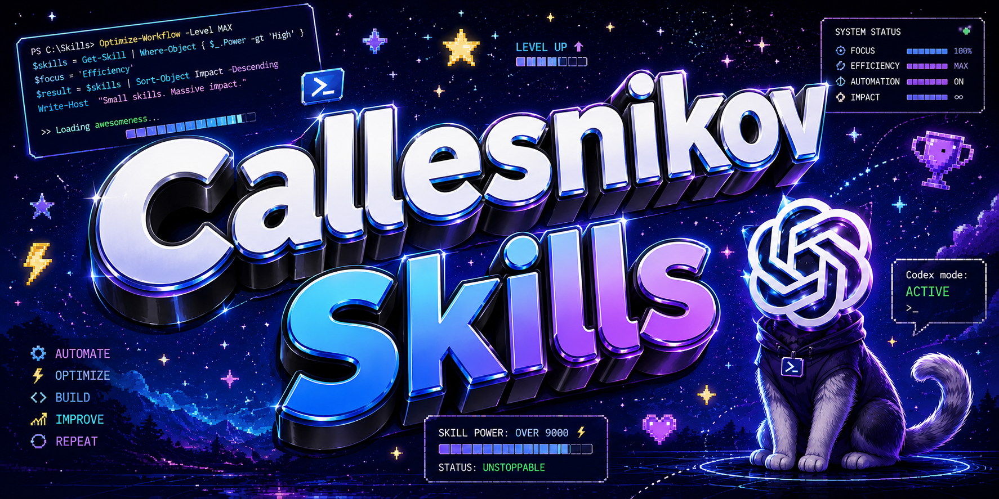

<p align="center">
  
</p>

<p align="center">
  <a href="#skills"></a>
  <a href="#principles"></a>
  <a href="#custom-header"></a>
</p>

<h1 align="center">Kolesnikov Codex Skills</h1>

<p align="center">
  Персональная коллекция навыков Codex для локальных рабочих процессов:
  документы, Obsidian, речь, YouTube, UI-motion и честные аудиты сессий.
</p>

---

## Что Внутри

Это витрина для навыков Codex, которые начинаются с `kolesnikov-*`.
Каждый навык сделан под конкретный повторяемый сценарий: разобрать документ,
защитить Obsidian-граф, подготовить транскрибацию, сохранить YouTube-материал,
подобрать аккуратное движение в интерфейсе или закрыть длинную сессию без потери полезной памяти.

Источник истины по поведению каждого навыка остается в его `SKILL.md`.
Этот README нужен как красивая GitHub-страница: быстро понять, что есть в коллекции и зачем оно нужно.

<a id="skills"></a>

## Навыки

| Навык | Зачем нужен | Что делает |
|---|---|---|
| `kolesnikov-agent-summarizer` | Финальный аудит диалога | Проверяет сессию перед закрытием, архивированием, удалением или компакцией. Ищет анти-паттерны в промптах, инструментах и управлении контекстом, сохраняет полезную операционную память, предлагает кандидатов в новые навыки и пишет жесткий handoff для следующего чата. |
| `kolesnikov-liteparse-forked` | Локальный парсинг документов | Работает с PDF и другими документами через LiteParse. Извлекает текст, JSON со структурой, bounding boxes, OCR, выбранные страницы, скриншоты страниц и batch-результаты, при этом не трогает исходные файлы. |
| `kolesnikov-obsidian-refactorer` | Безопасная работа с Obsidian | Аккуратно обслуживает Obsidian vault и Markdown-базу: аудит заметок, ремонт wiki-links и embeds, сохранение алиасов, headings, frontmatter, безопасные переименования, красивый рефактор заметок и экспорт Markdown/Obsidian в PDF. |
| `kolesnikov-speech` | Локальная транскрибация длинного аудио | Ведет пошаговый пайплайн `ffmpeg` + `whisper.cpp`: preflight, нарезка аудио на чанки, подготовка папок, транскрибация чанков и склейка текстов. Все runtime-активы держит внутри папки навыка. |
| `kolesnikov-transitions` | Справочник аккуратных UI-переходов | Помогает выбирать motion для интерфейсов: dropdown, modal, panel reveal, смена чисел, badges, success/error-состояния, icon swap и переходы между страницами. Держит стиль практичным, быстрым и совместимым с `prefers-reduced-motion`. |
| `kolesnikov-youtube-preserver` | Сохранение YouTube-видео и аудио | Скачивает YouTube-материалы через обертку над `yt-dlp`. Поддерживает качество, аудиоформаты, thumbnail, subtitles, metadata JSON, opt-in для playlist, retries и Windows-safe имена файлов. |

<a id="principles"></a>

## Принципы

- **Local-first:** инструменты, runtime, модели, outputs и вспомогательные файлы живут локально и предсказуемо.
- **Без скрытых разрушительных действий:** исходники, vault, PDF и архивы не перезаписываются без явного намерения.
- **Узкий фокус:** каждый навык решает один повторяемый класс задач, а не превращается в расплывчатый режим на все случаи.
- **Сначала доказательства:** перед правками Codex должен посмотреть реальные файлы, структуру, vault или runtime.
- **Память в артефактах:** повторяющиеся сценарии стоит переносить в scripts, references или правила навыка, а не оставлять только в истории чата.

## Рекомендуемая Структура

```text
skills/
  kolesnikov-agent-summarizer/
    SKILL.md
    references/
  kolesnikov-liteparse-forked/
    SKILL.md
    scripts/
    references/
    tools/
  kolesnikov-obsidian-refactorer/
    SKILL.md
    scripts/
    references/
  kolesnikov-speech/
    SKILL.md
    scripts/
    runtime/
  kolesnikov-transitions/
    SKILL.md
  kolesnikov-youtube-preserver/
    SKILL.md
    scripts/
```

## Как Использовать

Навыки рассчитаны на естественные запросы, без ручного выбора режима:

```text
Распарси этот PDF и сохрани структуру таблиц.
```

```text
Сделай безопасный рефактор этой Obsidian-заметки.
```

```text
Разбей длинное аудио и подготовь его к локальной транскрибации.
```

```text
Скачай аудио с YouTube в MP3 и сохрани метаданные.
```

```text
Перед закрытием чата сделай честный аудит сессии.
```

<a id="custom-header"></a>

## Своя Шапка

Да, свою шапку вставить можно. Более того, для личного GitHub-репозитория это часто выглядит лучше,
чем универсальный сгенерированный баннер.

GitHub README поддерживает обычные Markdown-картинки и часть HTML, поэтому самый удобный вариант такой:

```html
<p align="center">
  
</p>
```

Можно использовать:

- сгенерированный баннер через `capsule-render`;
- локальную картинку в репозитории, например `assets/header.png`;
- адаптивную dark/light шапку через HTML-блок `<picture>`;
- свои Shields-бейджи под баннером.

Для аккуратного вида лучше держать шапку широкой, читаемой на маленьких экранах и связанной с темой репозитория.

## Улучшение Навыков

Когда навык усиливается, лучше обновлять ближайший источник истины:

- `SKILL.md` для поведения, trigger rules и ограничений;
- `scripts/`, если workflow стал повторяемым;
- `references/`, если появились длинные правила, upstream-доки или примеры;
- README, только если меняется публичная карта коллекции.

---

<p align="center">
  Собрано для Codex-среды, где локальные файлы, аккуратные инструменты и повторяемые workflows действительно важны.
</p>
